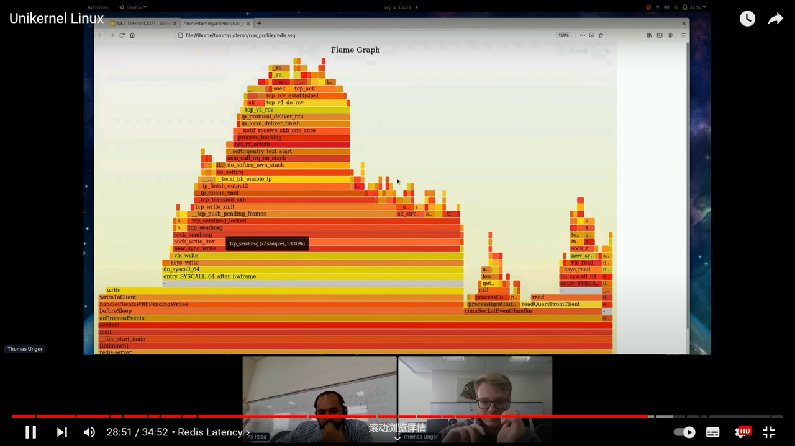

# unikernel overview

## Exokernel: an operation system architecture for application-level resource management

> \[论文] Exokernel: An operating system architecture for application-level resource management
>
> \[论文链接] [https://dl.acm.org/doi/pdf/10.1145/224057.224076](https://dl.acm.org/doi/pdf/10.1145/224057.224076)
>
> \[备注] 非常牛逼！&#x20;

### &#x20;论文摘要

**应用程序级别的资源管理** （不受信任的）传统的操作系统抽象，比如虚拟内存和进程间通信，都是在应用程序级实现。一个古老简单的思想：原语的级别越低，实现越有效，赋予高层抽象实现者的自由越多。为了实现最低级别的接口，**将保护从管理中分离出来** 。(这个意思是exokernel 不需要实现 windows 机制去保护 framebuffers，也不需要实现文件系统去保护磁盘）给每个应用一个虚拟机（性能下降 -> 导出硬件资源而不是模拟）三个技巧安全导出资源：安全绑定（应用程序绑定到硬件资源），可见的资源撤销（应用程序参与资源撤销协议），异常中止协议 exokernel 可以强制解除不合作的应用程序的安全绑定）

传统的操作系统使用中心化的资源管理方式（宏内核和微内核）提供了一组抽象，是不能被定制化，扩展和代替的。所有非应用程序都应该使用这种抽象，包括进程，文件，地址空间和进程间通信。在应用程序级别提供传统的抽象。

为了实现各个库互补干扰，通过低级接口从管理中分离保护。三个重要任务：1. 跟踪资源的拥有者； 2. 通过守护所有的资源使用和绑定点来确保保护； 3. 资源的调用控制 为了实现这些任务，exokernel使用了三个机制。

1. 使用安全绑定，库操作系统可以安全绑定到机器资源
2. 可见的调用允许库操作系统参加到资源调用协议
3. 异常终止协议强制解除和不合作的应用程序的安全绑定

## Unikernel: Library operating system for the cloud

> \[论文] Unikernel: Library operating system for the cloud
>
> \[论文链接] [https://obomprogramador.com/papers/2013-asplos-mirage.pdf](https://obomprogramador.com/papers/2013-asplos-mirage.pdf)

如果虚拟设备的所有软件层都是用同一个安全高级语言框架中编译的？问题一：哪些软件层？问题二：哪些虚拟设备？问题三：哪种高级语言？\
高度分层的软件堆栈包括什么？

* 旧的物理协议
* 不相关的优化
* 向后兼容的接口（posix）
* 用户空间的进程和线程
* 托管代码运行时
* 操作系统虚拟化

这是我们的问题：我们真的需要上百个软件模拟来调试哪怕最简单的程序吗？\
编译器解决方案：XEN和MirageOS将整个VM重组为更模块化的组件有一个问题：为什么unikernel一定是库操作系统？如果一个设备的所有软件层都是模块化的？这有什么好处呢？\

* 自动内存管理：因为有运行时系统自动进行内存管理，使用高级程序语言，有垃圾回收器等等
* 模块化：单个源代码的更改范围受到限制
* 元编程：在编译时知道运行时的信息以便更好的进行优化，而不是仅仅生成很多范型

在多大程度上统一库操作系统底层的编程模型：使用函数式编程？正确的模块化抽象？\
在编译时剥离功能是什么意思？\
{这里没看明白}Unikernels 采用了一种不同的方法，将配置整合到编译过程中。Unikernels 不把数据库、网络服务器等作为必须通过配置文件连接在一起的独立应用程序来处理，而是把它们作为单个应用程序中的链接库来处理，允许应用程序开发人员使用简单的动态参数库调用或静态参数构建系统工具来配置它们。这样做的有益效果是，配置决定在宿主语言中变得明确和可语法化，而不是操作许多临时文本文件，从而受益于静态分析工具和编译器的类型检查器。最终结果是大大减少了配置复杂的多服务应用虚拟机所需的工作量。

## The rise and fall of the operating system

> \[论文] The rise and fall of the operating system
>
> \[论文链接] [https://www.usenix.org/system/files/login/articles/login\_oct15\_02\_kantee.pdf](https://www.usenix.org/system/files/login/articles/login\_oct15\_02\_kantee.pdf)

现有操作系统的重要思想在50年前就已经出现了，那么从那之后发生了什么呢？

**It’s Called Hardware Because It Makes Everything Hard**

硬件是另一个黑盒子。为应用程序提供一个有用的硬件接口是操作系统的主要任务之一，无论是分时系统还是其他操作系统。让我们先把这个问题解决掉。问题是:为什么硬件本身不能提供一个有用的接口?我们必须回顾历史。\
由于增加了处理能力，系统软件假装它仍然知道设备的内部细节(例如旋转延迟)的方法已经过时，或者至少是摇摇晃晃的。

硬件设备驱动程序的解决方案是将复杂性推到2015年，而不是1965年。有些人说，他们不相信硬件供应商能把复杂的软件做好，因此复杂性应该留在运行在CPU上的软件中。只要系统软件作者也不能使软件正确，那么在正确性上就没有太大的区别。由于开源系统软件实际上是开源的，因此在操作系统中使用大多数逻辑确实具有优势。每个人都想要审查和调整开放源代码中的10万多行代码&#x20;

操作系统存储栈实际上可以做到这一点，至少如果他们有几年的空闲时间的话。相反，当硬件供应商声称支持“开源”时，开源驱动程序与硬件的模糊表示进行通信，有时通过标准接口，如SATA AHCI或 高清音频，所以在现实中，驱动程序几乎没有透露硬件中发生了什么。

如果硬件供应商真正理解“开源”的含义:发布最容易理解的表示，而不仅仅是可以通过编译器运行的任何残片，那么复杂I/O设备的可信度将得到提高。供应商可能宁愿不理解，特别是如果我们继续购买他们的硬件。智能但非开放的硬件会是一场灾难吗?

技术应该封装复杂性，并针对一般情况进行优化，而不是针对最坏的情况，即使这意味着我们软件人员要放弃控制硬件的幻想

**If It Is Broken, Don’t Not Fix It**为什么我们对方形的钉子如此着迷?如果我们抛弃整个操作系统会发生什么?这种方法的第一个问题是，应用程序将无法运行，这是一个不折不扣的问题。

**There Is No Such Thing as Number One**

【这一段写得非常的好，它提醒你应该怎么去考虑unikernel的安全性和隔离性的问题】

从最简单的情况开始，有一种嵌入式风格的情况，您在一块硬件上运行一个信任域。在这里，您只需要一组子例程(驱动程序)来运行您的应用程序。您不需要任何代码来允许单用户、单应用程序系统像具有多个用户的分时系统一样运行。单应用程序系统比单用户系统更简单灵活，单用户系统又比多用户系统更简单灵活。

第二，我们有云。在云上运行整个分时系统作为供应单元并不是解决问题的办法。作为一种引导机制，它非常出色:一切都像没有虚拟化的情况下一样工作，因此学习曲线可以近似为零倾斜。在其他方面，“操作系统中的每个问题都可以通过消除间接层来解决”这句话是合适的。对运行完整操作系统的资源浪费的抵制是容器，即由单个分时内核提供的名称空间虚拟化。虽然容器更便宜，但缺点是难以保证客人之间的安全和隔离。当前的云趋势正在向unikernels发展，unikernels是由MirageOS项目\[6]创造并推广的一个术语。这里的想法是，您可以像查看单个应用程序硬件一样查看云客户机。hypervisor提供必要的隔离并控制来宾资源的使用。由于虚拟机监控程序只向客户机公开一个简单的类似硬件的接口，因此与容器相比，推断可以和应该发生什么要容易得多。（这里要重点去看，因为这里和你疑惑的安全息息相关）

此外，如果可以合理地对计算进行分区，使一个应用程序实例最多只需要一个全职核心，那么大多数多核编程性能问题就会消失。

（这个问题是我没有想到过的）我们还需要解决复杂的通用桌面/移动情况，这本质上意味着在可用性和限制不受信任的应用程序做什么之间取得平衡。虚拟化将为我们提供应用程序之间的隔离，但是它会提供太多的隔离吗?（namespace提供的隔离和hypervisor提供的隔离有什么区别）

值得注意的是，当您进行虚拟化时，优化资源使用变得更加困难，因为应用程序不知道如何在大生态系统中发挥作用。对于云，这种程度的普遍无知并不是一个大问题，因为您可以向云添加另一个数据中心。（这是什么意思？）

如果您的手机以非常松散的方式使用本地硬件资源，您就不能在口袋中添加另一个数据中心。时间会告诉我们虚拟化适应桌面\[7]是否是一个足够好的解决方案，或者如果需要更细粒度和更精确的方法\[8]，或者在更具体的前提条件下，它们都是正确的答案。

即使在桌面上，方钉也不是正确的形状:我们知道系统将由单个人使用，并且系统不需要保护用户免受不存在的其他用户的侵害。相反，系统应该保护用户免受恶意软件、间谍软件、特洛伊木马和其他任何可以爬上网络管道的东西的侵害。

**What We Are Doing to Improve Things**

【这一段简直拍案叫绝！！！非常精彩】

我们可以称它们为驱动程序，我们可以称它们为组件，我们可以称它们为子程序，我们可以称它们为库，但我们需要计算堆栈底部的挂钩来运行我们的应用程序。实际上，除了软件栈的最顶层之外的所有东西都是一个库。如今，硬件几乎是无限的，是“系统驱动程序”还是“应用程序库”主要取决于个人喜好。

滚动你自己的驱动程序是一场无望的战斗。为了解决这个市场，我们在http://rumpkernel.org/上提供了组件化的、可重用的驱动程序。这些驱动程序来自于未经修改的可靠内核。任何需要修改(也就是移植)和维护的方法都会给拥有大量开发人员资源的大型项目带来难以承受的负担。

将软件堆栈视为驱动组件的自下而上结构，可以自由地单独解决每个问题，而不是试图发明方法使问题与山地机器同构。当然，从分时系统中解脱出来的驱动仍然会表现出分时的特征——驱动也没有所谓的第一名。例如，TCP/IP驱动程序仍然会阻止非根用户绑定到小于1024的端口。例如，在unikernel中，您可以自由定义根或非根的含义，或者简单地编译驱动程序的端口签出。您可以单独执行这些修改，以适应每个应用程序的需要。 作为一个好处，为分时、posix系统编写的应用程序将不知道是什么攻击了它们。它们之所以能正常工作，是因为驱动程序提供了应用程序所期望的几乎所有东西。

我们最终通过rumpkernel.org: Rumprun构建了一个基于残余内核提供的驱动程序的单内核。我们并没有试图构建一个类似操作系统的层，但有一天我们意识到我们可以用最少的努力构建一个可以正常工作的层。rumrun unikernel的值得注意之处并不在于现有的软件如Nginx、PHP和mpg123可以以正常的方式进行交叉编译，然后直接在云端或裸机上运行。值得注意的是，它的实现只有几千行代码……+驱动。驱动程序与“操作系统”的比例大约为100:1，因此其中几乎没有操作系统。Rumprun实现是一个编排系统，它指挥驱动程序。

**Conclusion**

【回归现实，还是要看实现的难度和挑战】

分时系统诞生于50多年前，我们对操作系统的概念就是从这个时期开始的。那时，硬件是简单、稀缺和神圣的，这些属性推动了系统和用户概念的发展。在现代世界，计算以多种方式完成，而包罗万象的操作系统已经被淡化了。

半导体技术的进步使硬件变得智能，但硬件仍然暴露出哑接口，部分原因是我们害怕智能硬件。

现代操作系统最令人尊敬的特性是支持运行现有的应用程序。最低限度实现的应用程序支持是几千行代码加上驱动程序，正如我们用rumrun unikernel演示的那样。因此，没有理由将一个操作系统移植到每个问题空间中。相反，我们可以将操作系统分为“编排系统”(也有一个吸引人的OS首字母缩略词)和驱动程序。两者都有各自的角色。 驱动决定了什么是可能的。编排系统定义了驱动程序应该如何工作，特别是不允许它们如何工作。这两条路径应该相对独立地进行研究，而不是将它们深深纠缠在一起的经典系统开发。

## **Unikernels: The Next Stage of Linux’s Dominance**&#x20;

> \[论文] Unikernels: The Next Stage of Linux’s Dominance
>
> \[论文链接] [https://cs-web.bu.edu/fac/jappavoo/Resources/Papers/unikernel-hotos19.pdf](https://cs-web.bu.edu/fac/jappavoo/Resources/Papers/unikernel-hotos19.pdf)

unikernel为什么是安全的？\
\
unikernel是目标应用程序和专门的内核链接在一起直接部署在虚拟或物理硬件上。（这个内核一定是库操作系统吗，为什么不能是Linux内核，所以ukl做了这件事情）\
问题的根源在于unikernels的开发方式。到目前为止，创建新的unikernel遵循以下两种方法中的一种:一种是clean slate方法，即基本上从头构建内核;另一种是strip down方法，即剥离现有内核代码库中认为对unikernel不必要的功能。使用clean slate方法，unikernel设计者可以完全控制用于构造内核的语言和方法。有了这样的自由，最终的实现可以非常专门化，并限制到特定的应用程序类（比如MirageOS只支持用OCaml写的应用程序）全新unikernel中的实现还可以对性能进行微调，并提供可以直接为其编写应用程序的高效、低级接口。unkernels，例如OSv \[17]， IncludeOS\[9]和EbbRT\[29]试图平衡高性能组件与c标准运行时并且部分支持常见的类posix接口。问题是，全新的unikernels不能(也不应该)希望支持通用内核提供的相同的无数接口和选项，至少在不放弃或混淆有效的路径和精细的实现的情况下是这样，而正是这些路径和实现使得全新的unikernels一开始就具有吸引力。由于对遗留软件的支持有限，在一个全新的unikernel上移植和支持现有的应用程序成为一项非常重要的工作，并且可能很快被认为“不值得付出努力”。另一种方法是，精简unikernels试图通过保留遗留内核代码库的通用库和接口来**简化软件移植**。也被称为残核，这个名字的灵感来自于英国内战之后对议会中保皇党人的臭名昭著的清洗——这个过程包括创建一个现有内核代码库的分支，并手动清除被认为对目标单内核不需要的组件。例如，RumpRun单内核包含一个NetBSD的大幅缩减版本\[16]。但是，就像在任何管理机构中一样，在继续支持广泛利益的同时，删除一组关键组成部分可能会出现问题。在这种情况下，创建树外分支放弃了原始内核代码库的基本资产，即它的全球贡献者社区。对不断发展的源内核所做的修复和更新不会免费提供给残余内核。相反，必须定期手动更新残余内核，以继续提供支持现有软件的最新平台。\

1. 大多数应用程序和用户库应该能够不经过修改就集成到unikernel中;构建单内核应该只意味着选择一个不同的GCC目标。
2. 避免任何特权级转换开销;任何请求内核功能的应用程序所经历的开销应该等同于一个简单的过程调用。
3. 允许跨层优化;编译器和/或开发人员应该能够共同优化应用程序和内核代码。（什么意思没看懂）
4. Linux源代码的更改应该是最小的，这样上游就可以接受它们，并且单内核可以成为Linux向前发展的一个组成部分。这将确保unikernels不是外人，而是任何人都可以选择为其编译应用程序的构建目标。

\
共享应用程序和内核代码混合目标的项目包括:1)用户模式Linux (UML)\[10]，它允许内核作为进程在用户空间中运行;2) Linux内核库(LKL)，\[27]它将内核打包成一个库，并创建一个虚拟机，内核在其中执行;3) LibOS\[1]，它将内核网络堆栈构建为共享库，并在用户空间中运行。所有这些方法都试图以这样或那样的方式重用内核代码，但没有实现我们的前两个目标。\
避免特权级转换的两种方法是:1)将应用程序作为Linux内核模块集成到内核中;2)允许未经修改的应用程序与内核一起在ring0中运行\[3,23]。我们选择了纯单内核方法，其中内核静态链接以运行单个应用程序。只有使用这种方法，我们才能启用配置时间和链接时优化，如果任意用户级应用程序可以与我们正在优化的应用程序一起运行，这是不可能的。\
\
做出的更改（重要）

1. 增加了一个新的内核配置选项，允许用户选择是否要将Linux内核编译为UKL。
2. 添加了对未定义符号的调用(由#ifdef)，可以用来调用应用程序代码，而不是创建第一个用户空间进程。
3. 创建了一个小型UKL库，其中包含系统调用的存根。这些存根隐藏了调用所需内核功能的细节，因为不再使用常规接口(即系统调用指令)。
4. 更改了glibc，使其不再对内核进行系统调用，而是对UKL库进行函数调用
5. 更改了内核链接器脚本，以定义新的段，例如存在于应用程序ELF二进制文件中的线程本地存储(TLS)段
6. 在调用应用程序之前增加了少量初始化代码，以取代通常由用户级代码完成的初始化，例如用于网络接口初始化。
7. 修改了内核链接阶段，以包含应用程序代码、glibc和UKL库，以创建单个二进制文件。

我们的原型使用了最新版本的Linux (v5.0.5)和glibc (v2.28)。glibc中进行系统调用的任何源文件都被复制到一个单独的子目录中并进行编辑，以便它转而对UKL库进行过程调用。显然，这里更改的行数与进行系统调用的次数相同。glibc中的更改包含在一个单独的子目录中，可确保正常的构建过程不会中断。一旦代码变得稳定，我们将不需要有一个单独的子目录;UKL函数调用可以与普通的glibc代码一起使用。glibc归档文件的总大小为45MB。我们总共修改了11行代码，并在Linux内核中添加了20行新代码，将其变成了一个单内核。这些更改不会破坏正常的Linux内核:关闭UKL配置选项将创建一个正常的Linux二进制文件，打开它将创建UKL二进制文件。这些适度的变化更有可能被上游所接受。\
构建过程（重要）\

* 编译glibc到一个没有任何链接的目标文件归档。
* 将应用程序代码编译成没有任何链接的目标文件，即使用-c选项。
* 将UKL库编译成一个对象文件。
* 使用UKL配置选项构建Linux内核。如上所述，内核构建过程中的链接阶段稍作修改，将前面创建的所有目标文件链接在一起。

\
\
事实上，我想找到UKL最初实现的测试用例tcp\_server，我想找到能够最快移植到riscv的测试用例，我认为devel-general分支可以满足我的需求。然而我没有找到帮助文档帮助我实验这个分支上的tcp\_server用户程序在哪里，以及glibc相关的库在哪里，我感到很迷茫，您能告诉我在UKL上改动最少的tcp\_server怎样才能运行成功吗？

## **Rethinking the Library OS from the Top Down**

> \[论文] Rethinking the Library OS from the Top Down
>
> \[论文链接] [https://www.microsoft.com/en-us/research/wp-content/uploads/2016/02/asplos2011-drawbridge.pdf](https://www.microsoft.com/en-us/research/wp-content/uploads/2016/02/asplos2011-drawbridge.pdf)

ASPLOS发布于2011年，在2022年评为influential paper.

阳光下并没有新的东西，但是这里有一些旧的东西是我们不知道的。

摘要：

* 重新审视了库操作系统，库操作系统就是将应用所依赖的操作系统和应用同处于一个地址空间。
* 描述了一个windows7的库操作系统原型，运行的应用包括excel ppt等。
* 每个实例能够有更小的开销
* 一个完整的commercial OS 一个库操作系统的重新设计
* 最终的结论是：库操作系统向我们保证的好处和前景——更好的安全和更快的演进——正准备被获得。

### 为什么 unikernel 一直不火？

有很多同时代的方法一样，unikernel 似乎也被时代遗忘了，它很大程度上是VMM的牺牲品。我们时常看到 unikernel 和 kata firecracker相比较，但实际上，它们可能并不属于同一个层面上的东西。我们可以在exokernel中看到，最初库操作系统的安全保证是由 exokernel 来保证的，他发布安全协议，使得应用能够绑定到这个安全协议。在VMM出现之后，这个exokernel相当于被VMM替代了，但是不是操作系统层面的改进我们就不需要了呢，是不是说底层有了VMM之后可以运行常规的操作系统，对于操作系统层面的简洁化和快速更迭的需要就被抹杀了呢？库操作系统带来的性能优势终究还是没有比过遗留的兼容问题。并且在1990s，由于互联网的兴起，安全性和隔离性更加的重视。但是我们可以看到现代操作系统的演进依旧非常缓慢，并且笨重，开发非常困难。【这里需要一些文献和数据来佐证，并且这里的语句顺序导致逻辑不通顺】\

### 讨论和总结

库操作系统允许包装应用，和重塑计算体验。包装应用的基本问题是 决定如何把应用和他的依赖项从环境中分离出来，所以应用可以在几乎无数种用户部署方案中可预测的运行。一个理想的包装技术是简单部署，即便os升级也能继续运行，便于迁移，防止应用破坏宿主机，防止宿主机破坏应用。库操作系统提供了新的方法包装应用。包括把应用和他们依赖的操作系统打包到一起，或者是应用包含通知宿主机他们所需要的库操作系统的需要包含的元数据。使用后一种方法，一个主机操作系统能够分发多个库操作系统镜像。

1. 应用的兼容性。

对于下面这段话：你要是非要这么说，我竟然无可反驳？译文：通过封装操作系统中最有可能破坏应用程序兼容性的部分，库操作系统提供了一种解决应用程序兼容性问题的新技术。每个应用程序都可以使用自己选择的库操作系统运行。程序员或IT管理员可以将应用程序绑定到一个已知的好的库操作系统，它将继续在新的主机操作系统版本上正确运行。例如，与Windows XP库操作系统打包的应用程序可以在Windows XP、Windows Vista或Windows 7主机操作系统上继续正确运行。相反，Windows 7的更新可以与Windows XP和Windows Vista的库操作系统一起发布。用户可以不受复杂的应用程序兼容性计算的限制而升级到新的操作系统版本。

2. 动态应用重载

通过序列化和反序列化（这里或许可以借鉴dora的零拷贝技术？）保存应用的状态，然后在另一个操作系统反序列化

3. 降低安全风险
